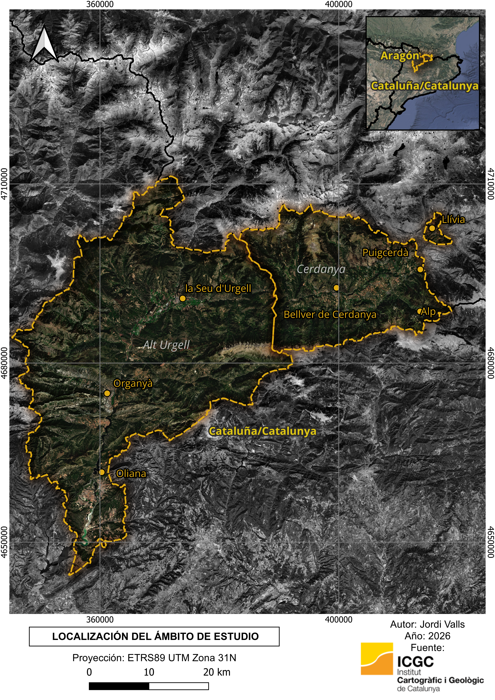
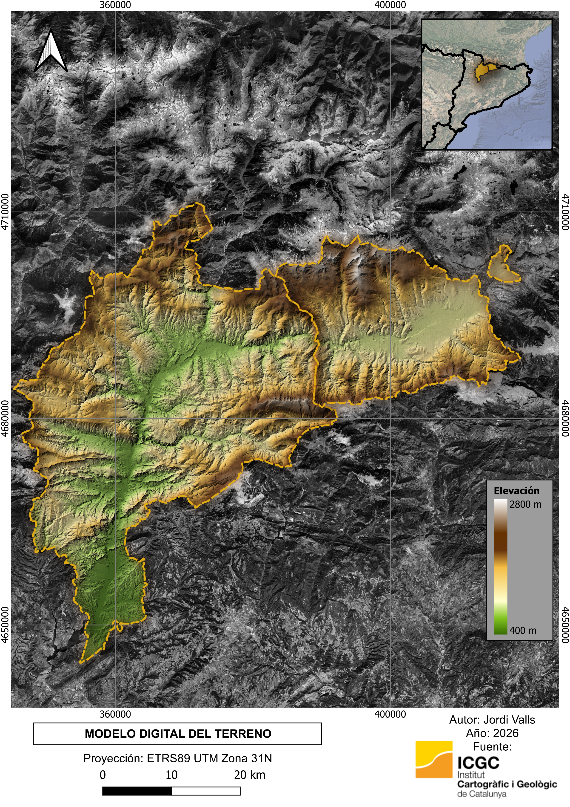

# Model Digital del Terreny - Cerdanya i Alt Urgell

Mapa elaborat a partir del MDT 5m de l'ICGC.

## Resultat

## Dades utilitzades

- MDT 5m (ICGC)
- Límits administratius (ICGC)

## Programari

- QGIS 4.0
