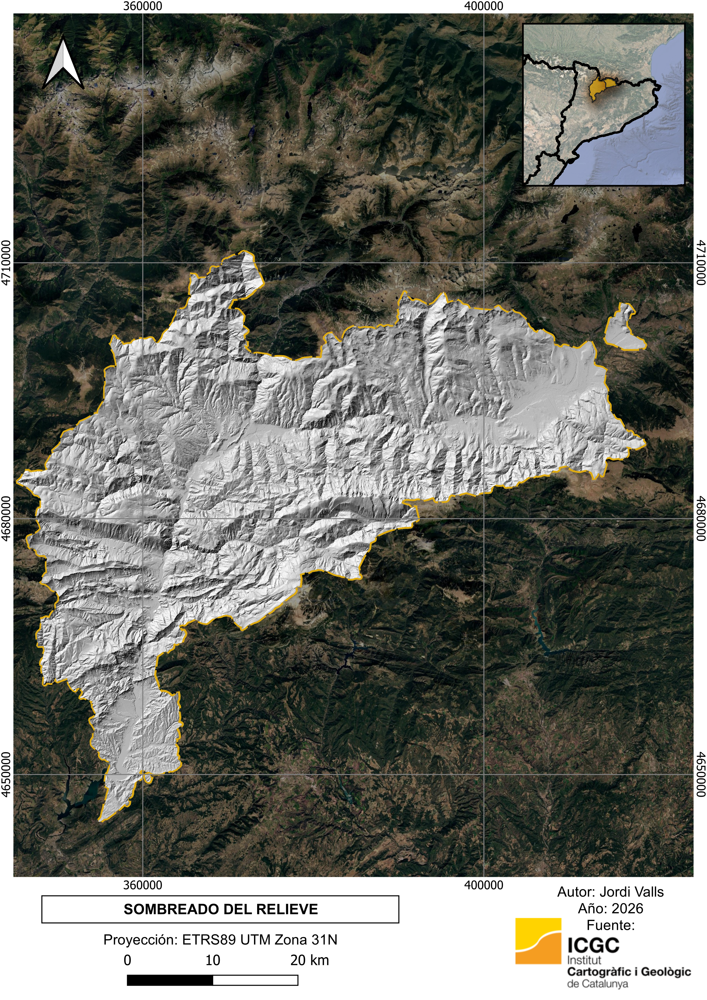
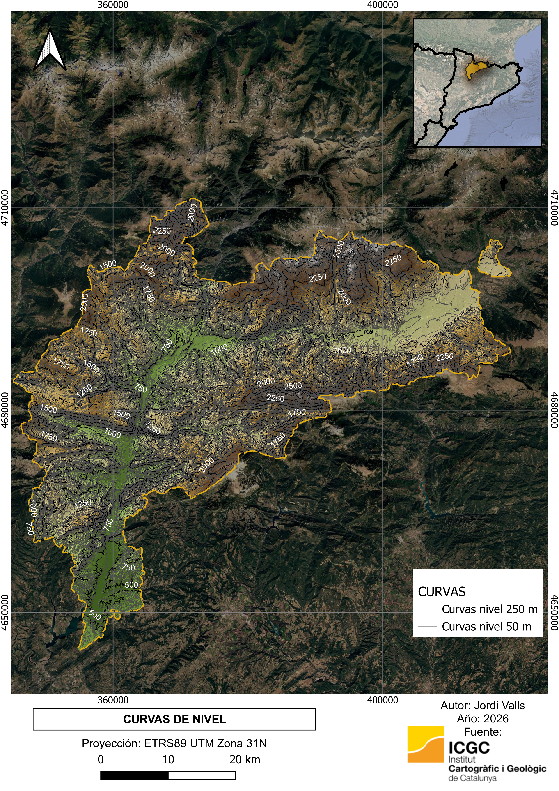
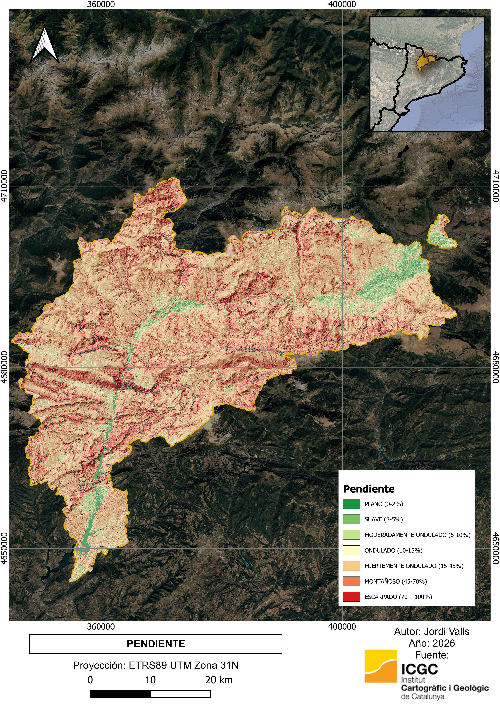
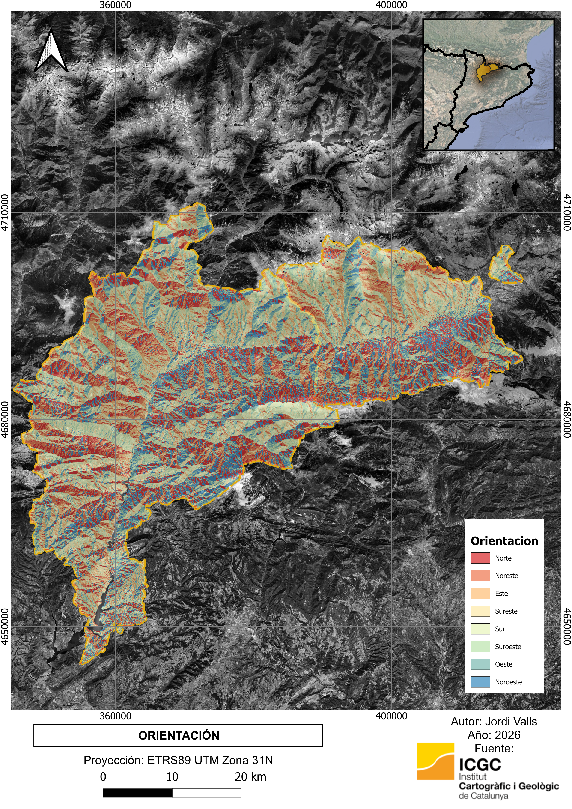

# Análisis del terreno - Cerdanya y Alt Urgell
Análisis topográfico del territorio de la Cerdanya y el Alt Urgell 
a partir de un Modelo Digital del Terreno (MDT) de 5 metros de resolución.

El proyecto incluye la caracterización del relieve mediante el análisis
de la elevación, el sombreado del terreno, las curvas de nivel, la pendiente
y la orientación de las laderas.

---

##  Localización del ámbito de estudio

El ámbito de estudio comprende las comarcas de la Cerdanya y el Alt Urgell,
situadas en el Pirineo catalán.

---

##  Modelo Digital del Terreno

El MDT permite representar la distribución de las altitudes y constituye
la base para el análisis de las características topográficas del territorio.

---

##  Sombreado del relieve

El sombreado del relieve permite mejorar la interpretación visual de la
topografía y facilita la identificación de valles, crestas y otras formas
del terreno.

---

##  Curvas de nivel

Las curvas de nivel representan las líneas de igual altitud y permiten
interpretar la configuración del relieve.

---

##  Pendiente

El análisis de pendiente representa el grado de inclinación del terreno
y permite identificar las zonas más abruptas y las áreas de menor pendiente.

---

##  Orientación

La orientación representa la dirección hacia la que se inclina cada ladera.

---

#  Datos utilizados

- **Modelo Digital del Terreno (MDT) de 5 m** — Institut Cartogràfic i Geològic de Catalunya (ICGC).
- **Límites administrativos** — ICGC.

#  Software utilizado

- QGIS 3.44

#  Autor

**Jordi Valls**  
GIS Analyst | WebGIS Developer | Oceanógrafo
